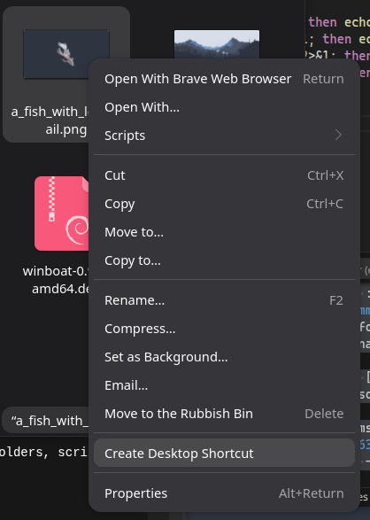

# 🐚 Nautilus Desktop Shortcut

**Nautilus Desktop Shortcut** is a lightweight **Nautilus Python extension for GNOME** that adds a right-click menu option to instantly create a **Desktop shortcut** for any file, folder, or photo.

🚀 **No copy–paste. No dragging. Just right-click and go.**

---

## ✨ Features

- 📂 Works with **all file types** (images, PDFs, folders, scripts, etc.)
- 🖱️ One-click **“Create Desktop Shortcut”** option
- 🐍 Built using the **Nautilus Python API**
- 🧠 Uses default applications via `xdg-open`
- 🔒 GNOME-safe (respects launcher security)
- 💡 Simple **install & uninstall** scripts

---

## 🎯 Why This Exists

GNOME removed native desktop shortcut creation.  
This extension brings it back in a **clean, native, and modern way** — without hacks or copy/paste workflows ❤️

---

## 🖥️ How It Works

1. Right-click any file or folder in **Nautilus**
2. Select **Create Desktop Shortcut**

  

3. A `.desktop` launcher appears on your Desktop
4. Right-click → **Allow Launching** (first run only)

---

## 🐧 Supported Systems

- Ubuntu **20.04+**
- GNOME Shell
- Nautilus (Files)

---

## 📜 License

**MIT License** — free to use, modify, and share ❤️
